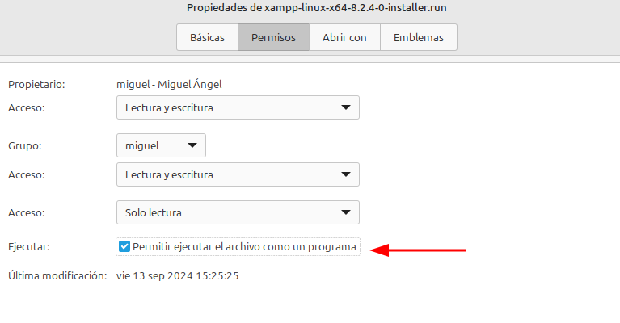
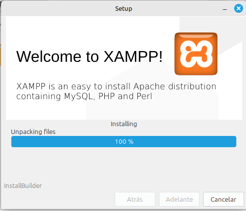

# Instalación de XAMPP

1. Se descarga el instalador desde el proyecto de [__Apache Friends__](https://sourceforge.net/projects/xampp/files/).

2. Darle __permiso de ejecución__.

3. Ejecutar el archivo con permisos de administrador desde la terminal.

> sudo ./xampp

4. Haz click en "Adelante" hasta que comienza la instalación, después, espera a que termine.

5. Para finalizar hacer click en "Finish".
