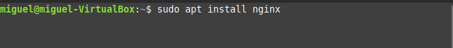
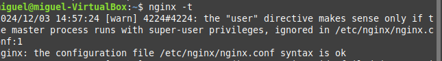
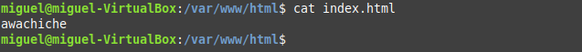

# Instalación cd nginx

Se instala nginx con apt

A continuación se comprueba que se haya instalado correctamente comprobando que la sintaxis está correcta.

Se modifica el fichero index.html situado en /var/www/html para comprobar que funcione

