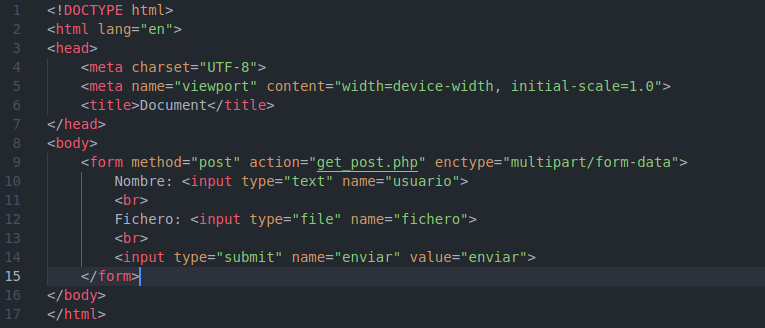

# GET y POST

Cuando usamos el GET, los parámetros se pasan en el encabezado de la solicitud. Por lo tanto, se pueden ver por la URI, como en el caso de nuestro formulario de inicio de sesión.

El POST, a diferencia del GET, envía los parámetros en el cuerpo de la solicitud HTTP. Escondiéndolos de la URI:

get_post:

html:
