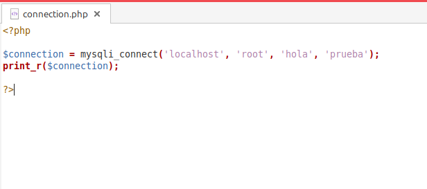
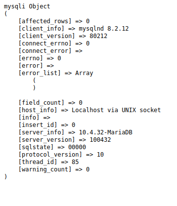

# Conexión a base de datos

Se crea el fichero conection.php y se introduce las siguientes lineas de código:

```php
    $conn = mysql_connect('localhost', 'root', 'mysql', 'prueba');

    print_r($conn)
```


