# Instalación LAMP

Se intala Apache2.

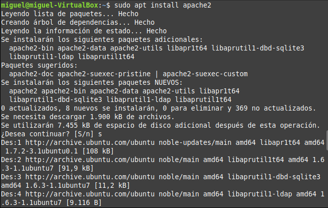

Se instala MariaDB.

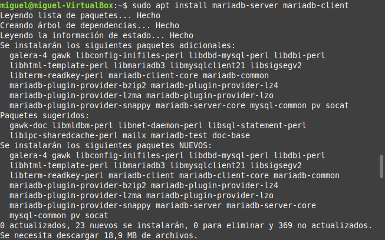

Se comprueba la instalación.

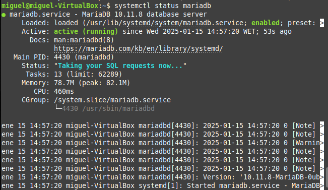

Se configura para que arranque cuando la máquina se inicie.

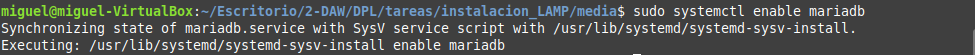

Se comprueba la versión.

Se ejecuta un script de seguridad.

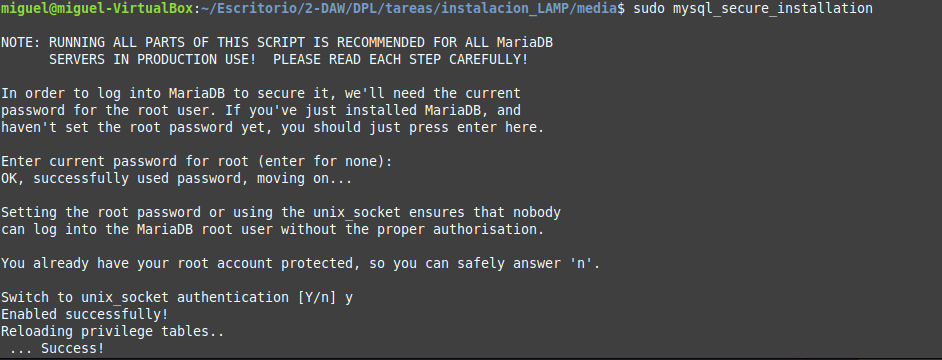

Accedo a la base de datos.

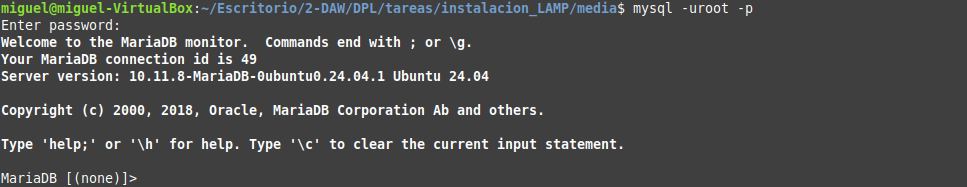

Creo el usuario 'developer'.

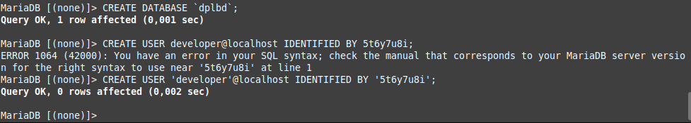

Compruebo que se haya creado correctamente.

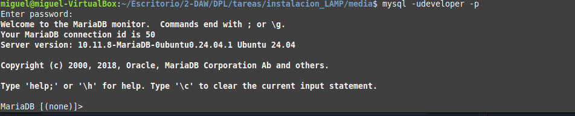

Instalo php.

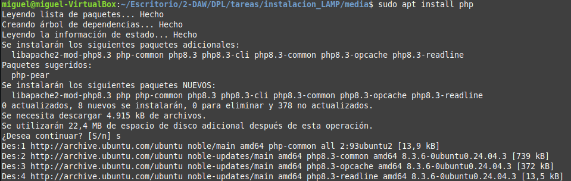

Se activa el modulo apache php8 y reinicia.
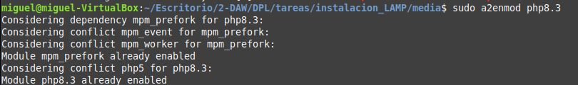
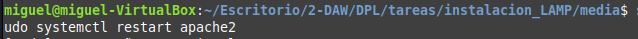

Abro el archivo __/var/www/html/info.php__.

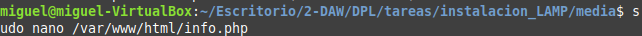
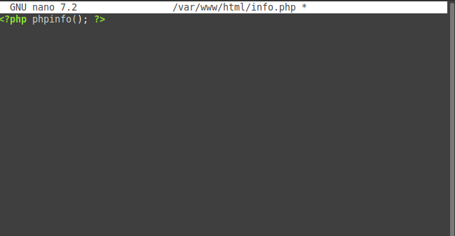

Compruebo info.php en el navegador.

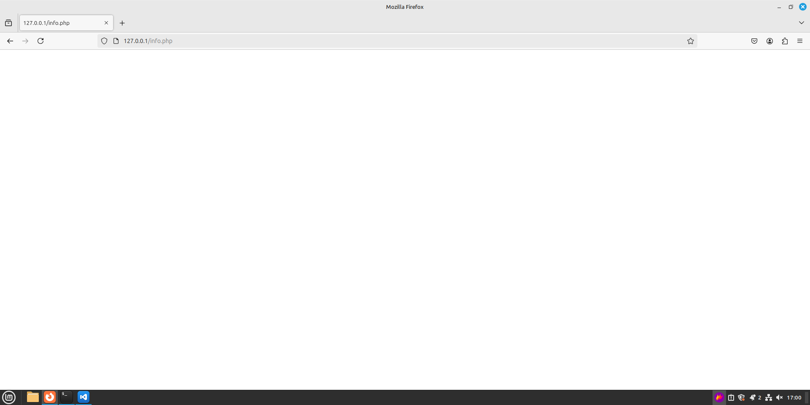

Instalo __PHP-FPM__.

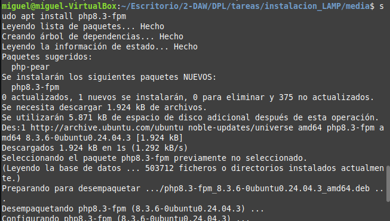

Habilito __proxy_fcgi__ y __setenvif__.

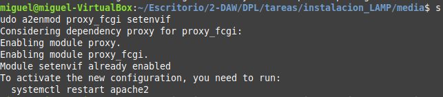

Reinicio apache2.

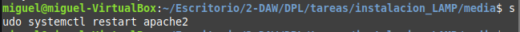

