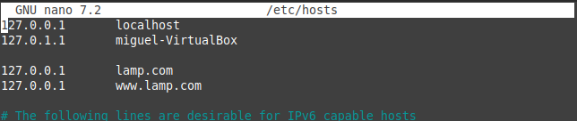
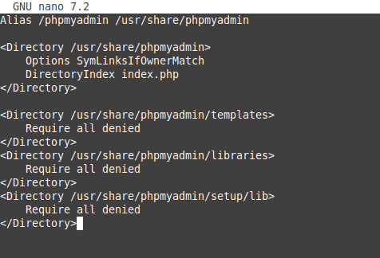

# Migración de XAMP a LAMP

Añado dominio con la ip local para crear un host virtual.

Creo el directorio de la pagina web.

Se copian todos los ficheros de xampp en este nuevo directorio.

Entro en la configuración de lamp.

Introduzco la configuración.

Habilito la configuración y reinicio apache2.

Instalo phpmyadmin.

Creo fichero de configuración de phpadmin en apache2 y añado la configuración.

Hailito la configuración y reinicio apache2.

Para migrar la base de datos hay que configurarlo para el acceso de phpmyadmin.

