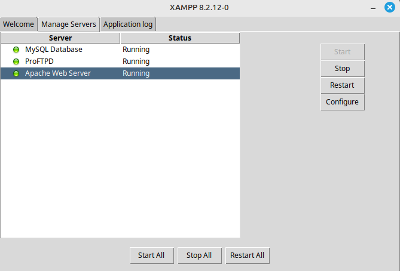
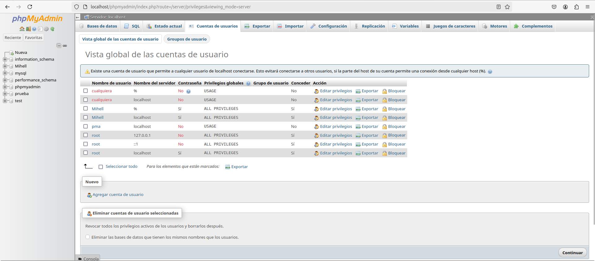
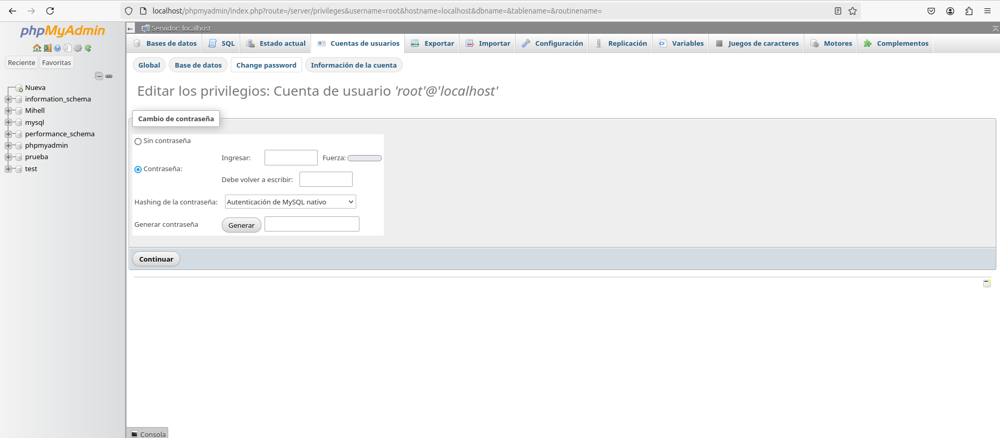
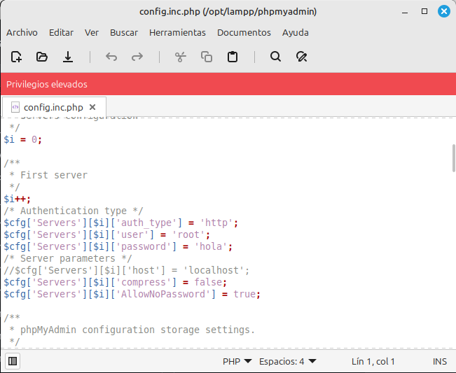
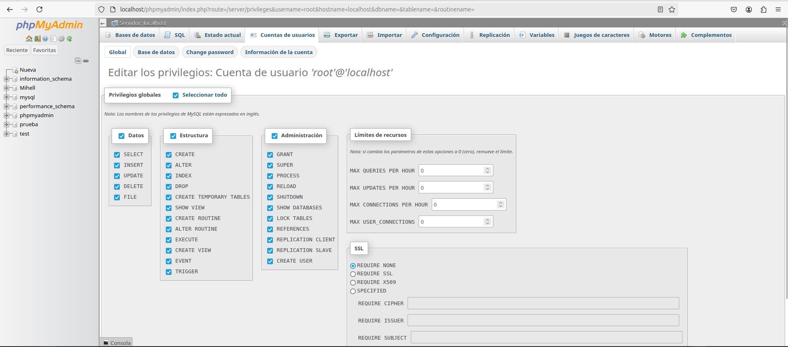
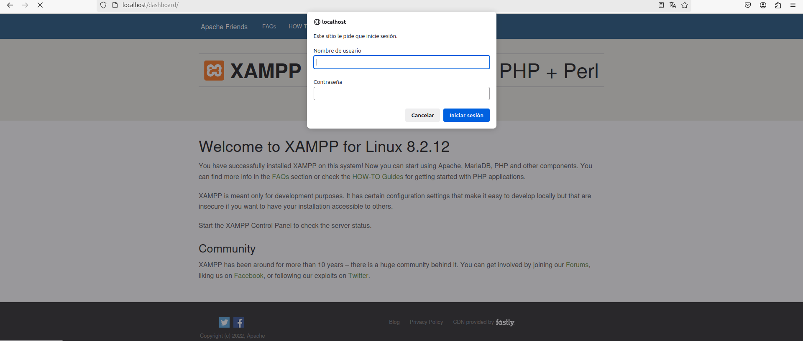

# Seguridad en XAMPP

Inicializo el servidor XAMPP.

 

Voy al localhost en el navegador y entro en phpmyadmin.

 

Establezco una contraseña para el usuario root.

 

Abro el fichero "config.inc.php" para establecer la contraseña de root y cambiar el el fichero para que me pida usuario y contraseña.

 

Acontinuación vuelvo a localhost/phpmyadmin, entro en el apartado de cuentas de usuarios y selecciono el usuario "root". Después le dare los permisos a el usuario "root".

 

Ahora necesitaremos usuario y contraseña para acceder

